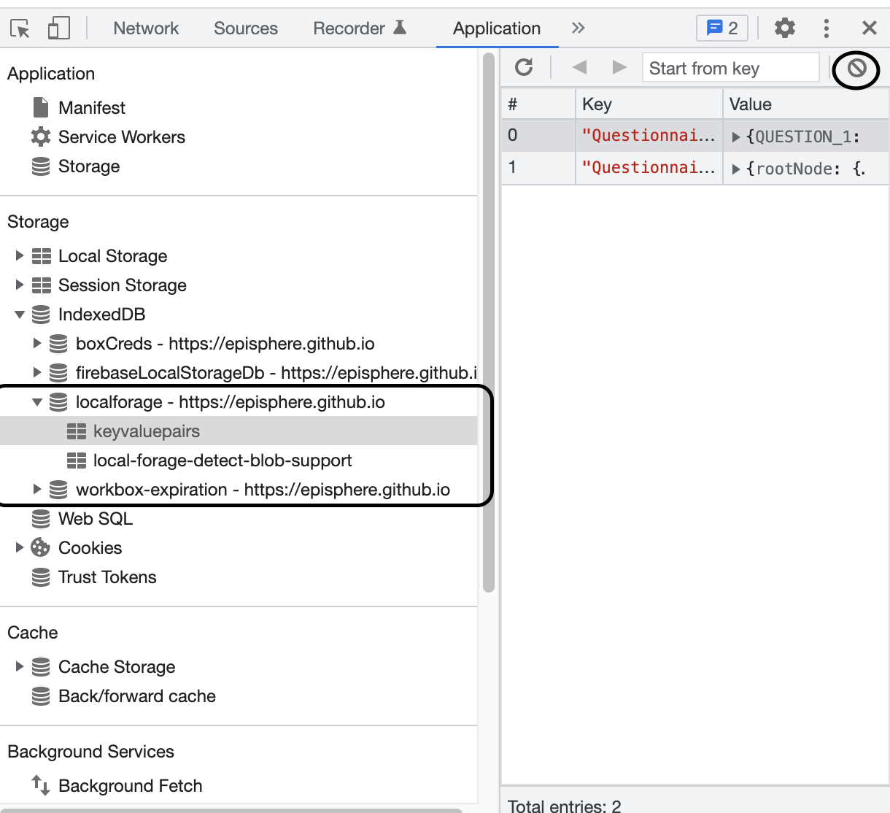

# questionnaire
Public Questionnaire for use with Quest

| example | use case | URL
|---|---|---|
| Example 1 in the Quest paper | plain module |  https://danielruss.github.io/questionnaire/paper_example1.txt |
| Example 1 in the Quest paper | in development tool |  https://episphere.github.io/quest/#https://danielruss.github.io/questionnaire/paper_example1.txt |
| Example 1 in the Quest paper | in test mode |  https://episphere.github.io/quest/?style=Style1.css&run#https://danielruss.github.io/questionnaire/paper_example1.txt |

Once you take a survey, the results are stored in your browser's IndexedDB.  To clear the results, you can use the development tool's "clear memory" button, or you can use the "Application" tab of your Browser's development tools.  The data is stored in the "localforage - epiphere.github.io" instance of indexedDB. Below is a screenshot of the application tab of the developer tools on Chrome.  Clicking on the circled button will clear the IndexedDB

